# Utilization of transfer learning with recurrent neural networks for grocery price forecasting

## Market rice price inside Pakistan

<p align="center">
    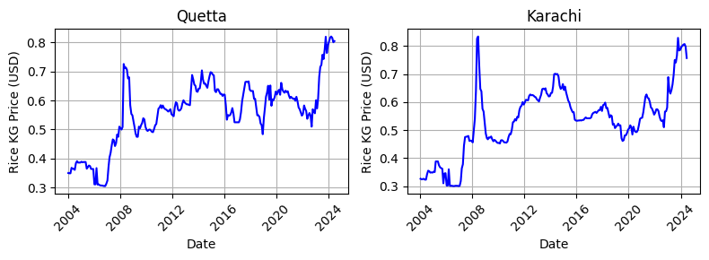
</p>

### Training and transfer learning results

<p align="center">
  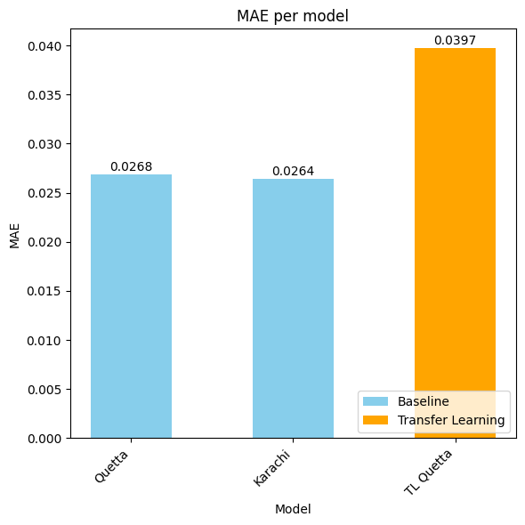
  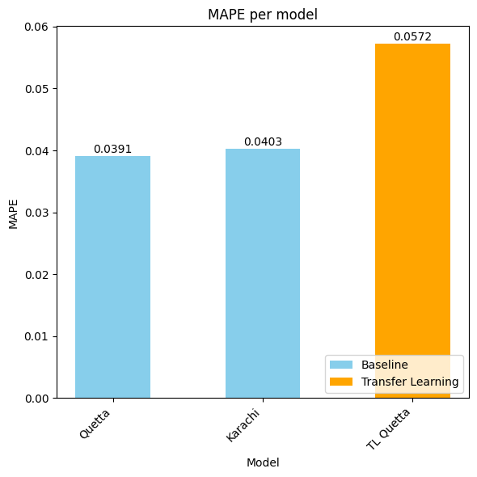
</p>
<p align="center">
  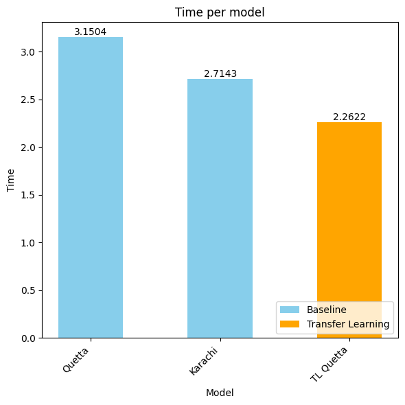
  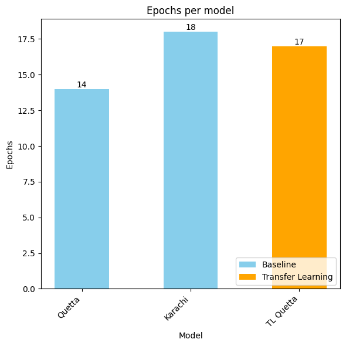
</p>

### Training and transfer learning plot

<p align="center">
    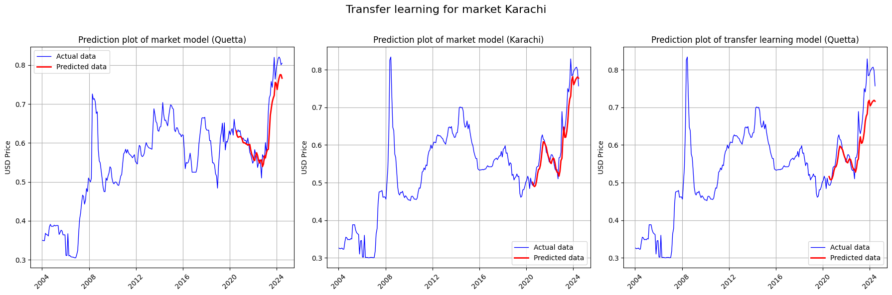
</p>

## Dataset

Datasets are taken from [WPF Food Market Price](https://data.humdata.org/dataset/?q=food+prices&sort=last_modified+desc&ext_page_size=25&page=3). Values are updated monthly.

Following columns are present:
`date, admin1, admin2, market, latitude, longitude, category,commodity, unit, priceflag, pricetype, currency, price, usdprice`

During the data preparation following measures were taken:

- Only groceries for retail were considered
- Price of grocery was averaged if it was in multiple cities
- Column `usdprice` was chosen for forecasting
- Datasets were selected from the same continent based on existance of the same grocery in the category of retail price, whole sale prices were not considered
- Large datasets are considered to have more than 15 years of data
- Small datasets are considered to have have less than 10

### Line plot of prices for Rice based on given criteria

<p align="center">
    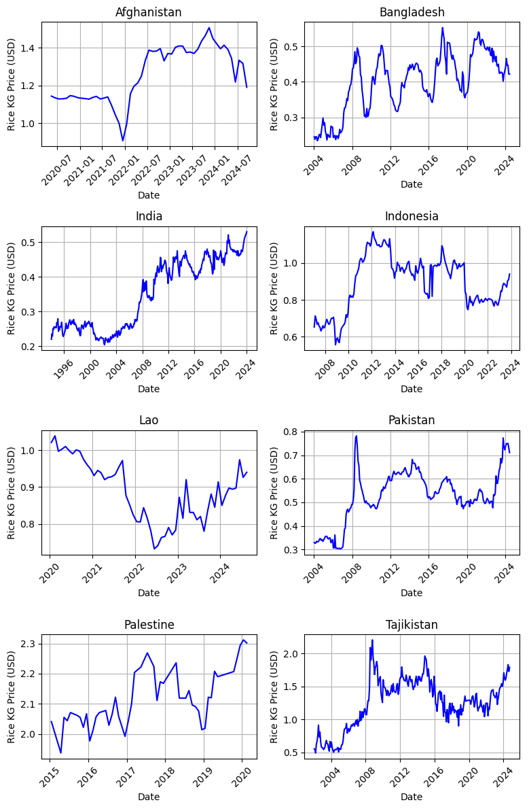
</p>

After analyzing line plots, following actions were taken:

- `Bangladesh, India, Indonesia, Pakistan, Tajikistan` are used for pretraining models, since they have bigger dataset (20 yrs)
- `Afghanistan, Lao` are used for transfer learning, since datasets are smaller (4 years)

During the preprocessing nothing else was done on the data, except for sorting and using `MinMaxScaler` before training.

💡 Entire process is visible at [data.ipynb](src/data.ipynb). 💡

## Model training

Dataset was split into 0.2 test size and 0.1 validation size.

The goal was to minimize MAE on test data, so the model used in transfer learning as pretrained is as precise as possible. For this reason following grid of parameters and hyperparameters is used:

```
param_grid = {
    'network_type': ['RNN', 'LSTM', 'GRU'],
    'learning_rate': [1e-4, 1e-2],
    'num_layers': [1, 2, 3],
    'neurons_per_layer': [32, 64, 128],
    'batch_size': [16, 32, 64]
}
```

Using `bayesian search` within `optuna` library was utilized for finding hyperparameters and it was exectuted in 500 iterations.

💡 All the results visible at [model.ipynb](src/model.ipynb). 💡

#### Result of training models using bayesian search of parameter grid

<p align="center">
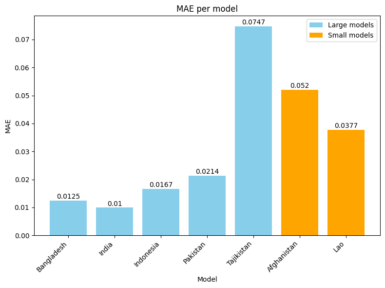
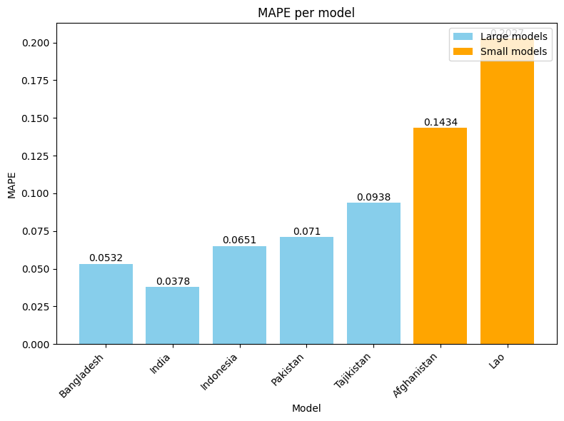
</p>

<p align="center">

</p>

## Transfer learning

For the data from `Afghanistan, Lao` the transfer learning was exectued in the following way:

- Pretrained models were loaded
- Last `Dense` layer was removed
- All remaining layers were frozen
- New `Dense` layer was added and trained with hyperparameters of loaded model

#### TL metrics for Afghanistan

<p align="center">
  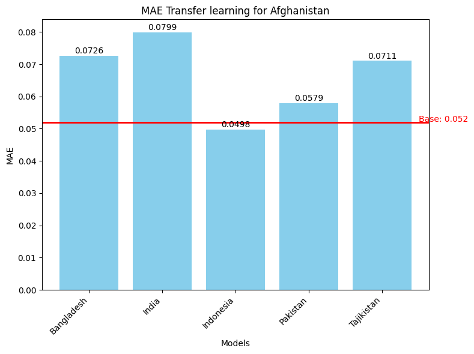
  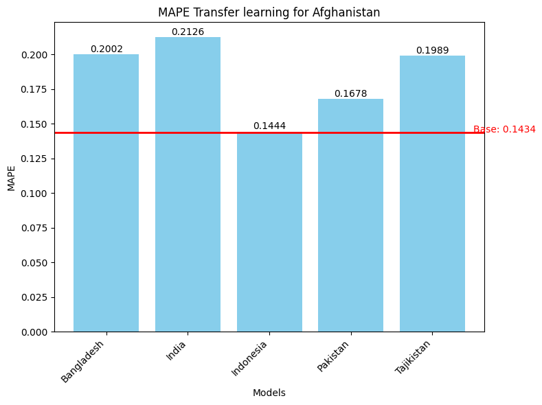
</p>
<p align="center">
  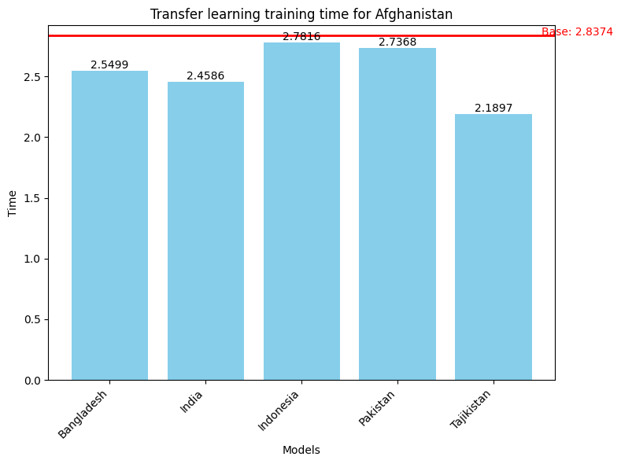
  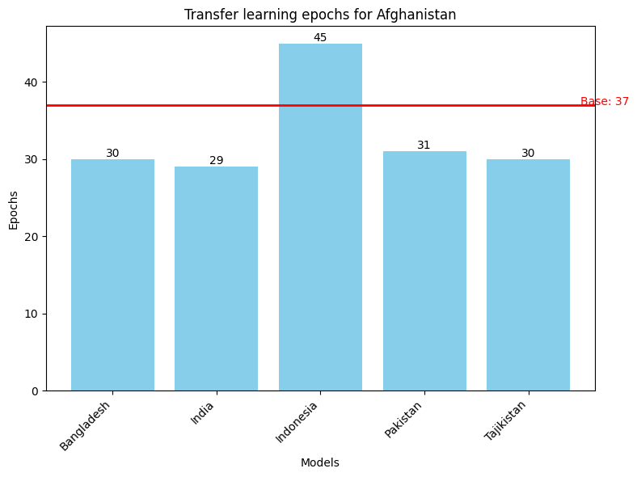
</p>

#### TL summary for Afghanistan

<p align="center">
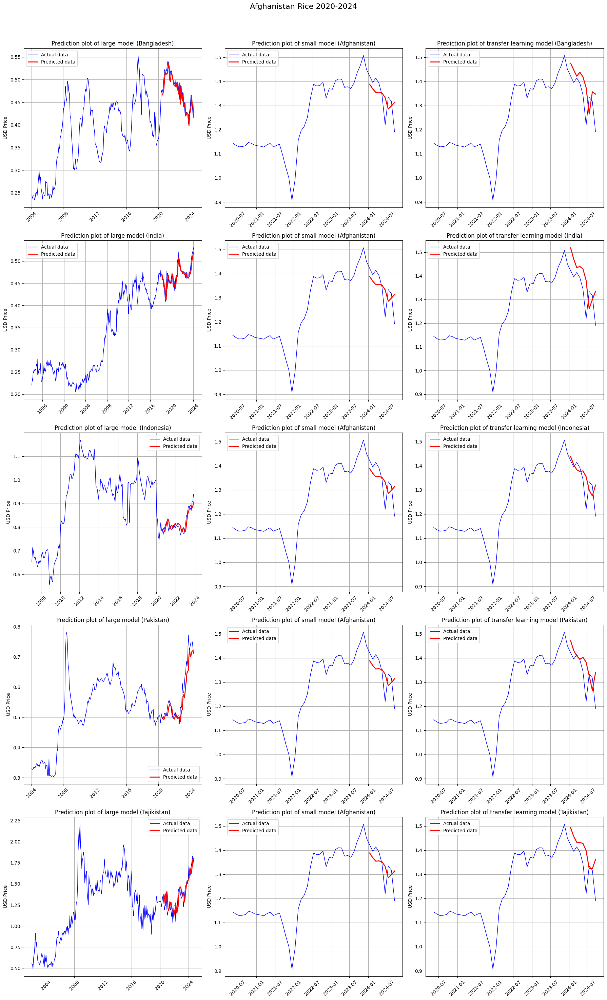
</p>

#### TL metrics for Lao

<p align="center">
  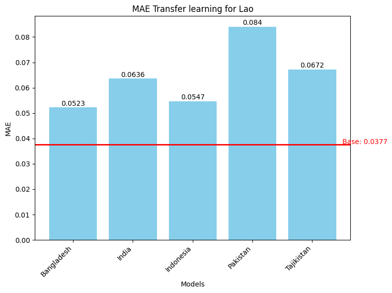
  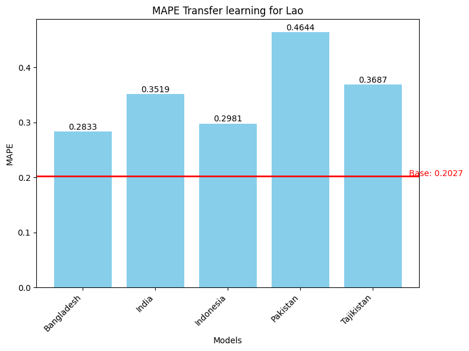
</p>
<p align="center">
  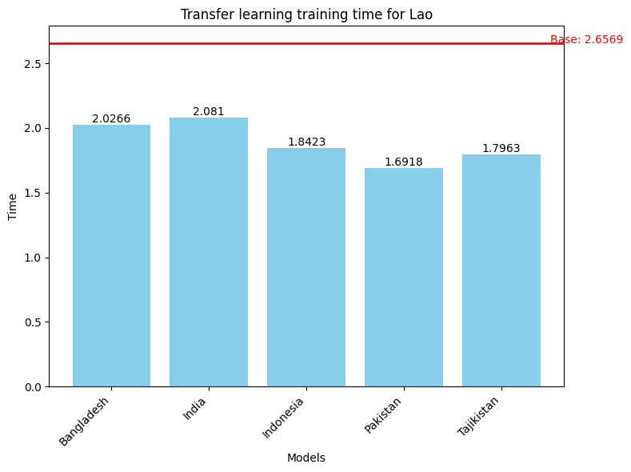
  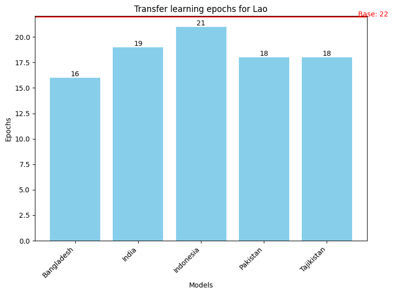
</p>

#### TL summary for Lao

<p align="center">
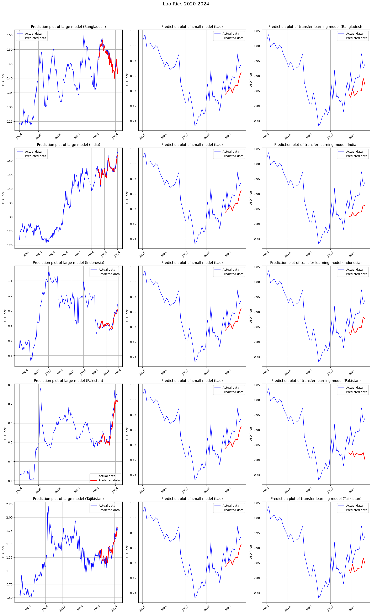
</p>

#### Case proof: Results for MAE Ukraine

<p align="center">

