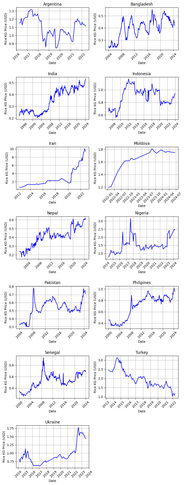
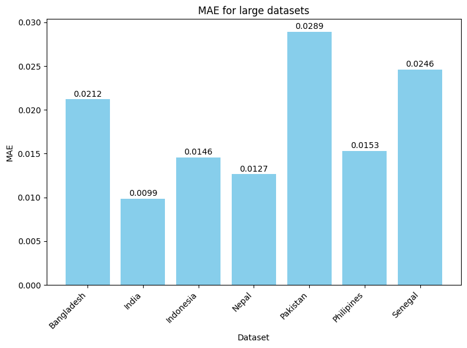
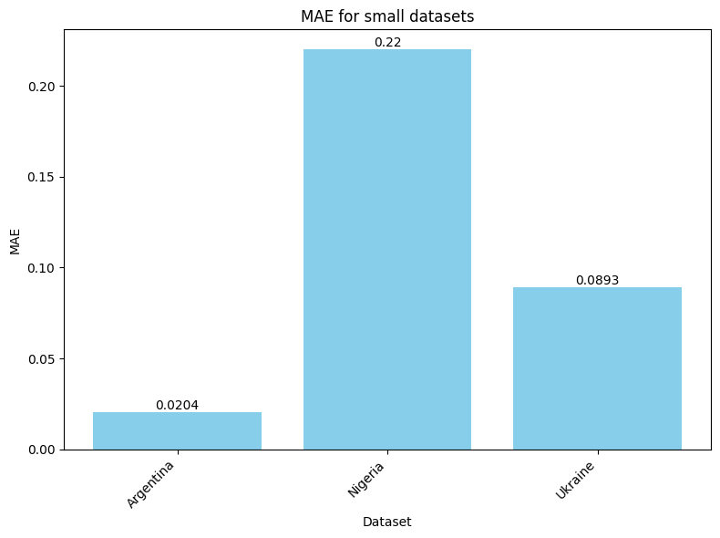
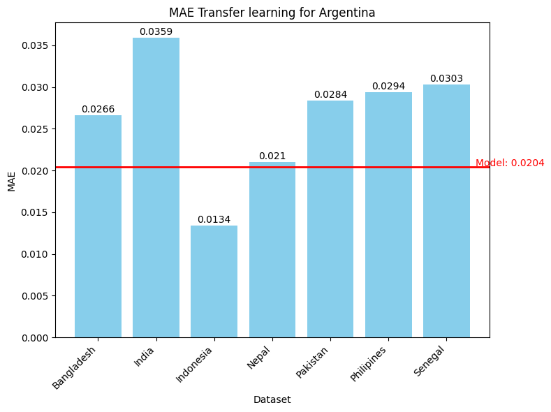
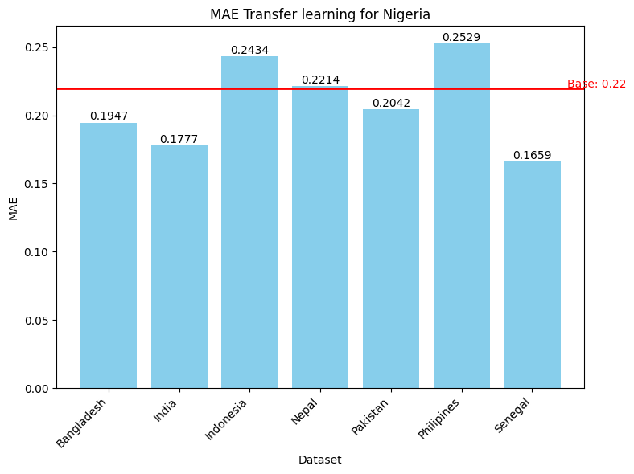
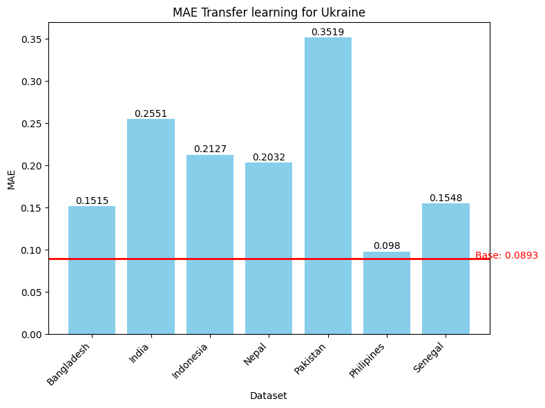
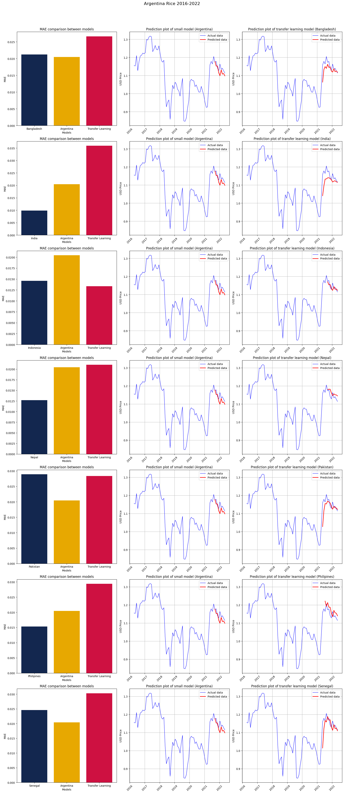
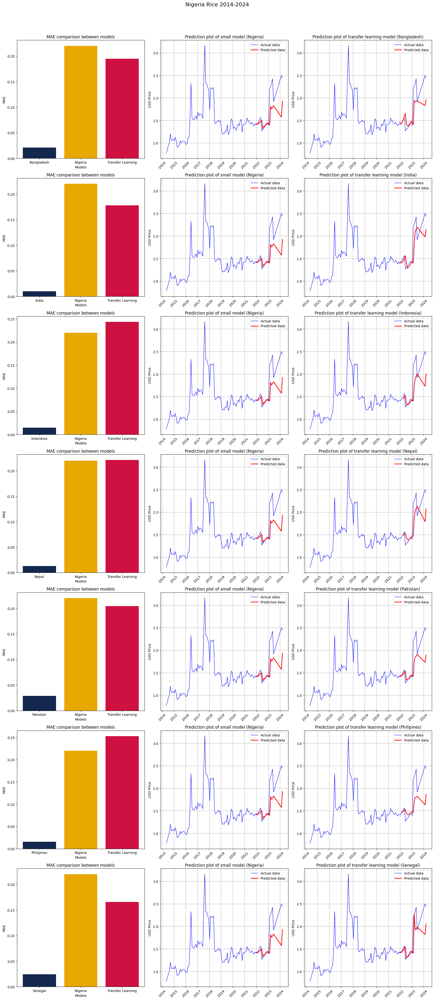
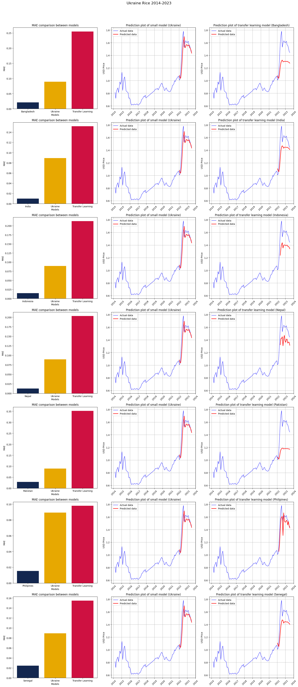

# Utilization of transfer learning with recurrent neural networks for grocery price forecasting

## Dataset

Datasets are taken from [WPF Food Market Price](https://data.humdata.org/dataset/?q=food+prices&sort=last_modified+desc&ext_page_size=25&page=3). Values are updated monthly.

Following columns are present:
`date, admin1, admin2, market, latitude, longitude, category,commodity, unit, priceflag, pricetype, currency, price, usdprice`

During the data preparation following measures were taken:

- Only groceries for retail were considered
- Price of grocery was averaged if it was in multiple cities
- Column `usdprice` was chosen for forecasting
- Datasets were selected based on existance of the same grocery
- Large datasets are considered to have more than 15 years of data
- Small datasets are considered to have have less than 10
- Other choice of datasets was random, in the sense that criteria for the country wasn't considered

### Line plot of prices for Rice based on given criteria



After analyzing line plots, following actions were taken:

- `Iran` had exponential growth in price and wasn't considered for next stage
- `Moldova` has data from the last 2 years, which isn't enough data
- `Turkey` is the only country where the price of grocery is dropping so it wasn't considered for next stage
- `Bangladesh, India, Indonesia, Nepal, Pakistan, Philipines, Senegal` are used for pretraining models, since they have bigger dataset
- `Argentina, Nigeria, Ukraine` are used for transfer learning, since datasets are smaller

During the preprocessing nothing else was done on the data, except for sorting and using `StandardScaler` before training.

💡 Entire process is visible at [data.ipynb](src/data.ipynb). 💡

## Model training

Dataset was split into 0.2 test size and 0.1 validation size.

The goal was to minimize MAE on test data, so the model used in transfer learning as pretrained is as precise as possible. For this reason following grid of parameters and hyperparameters is used:

```
param_grid = {
    'network_type': ['RNN', 'LSTM', 'GRU'],
    'learning_rate': [1e-4, 1e-2],
    'num_layers': [1, 2, 3],
    'neurons_per_layer': [32, 64, 128],
    'batch_size': [16, 32, 64]
}
```

At first, `random search` was utilized and the process of trainig and evaluating was exectued in 500 iterations. However, because of the time complexity it was replaced with `bayesian search` using `optuna` library and it was exectuted in 200 iterations.

💡 All the results visible at [model.ipynb](src/model.ipynb). 💡

#### Result of training larger models using bayesian search of parameter grid



#### Result of training smaller models using bayesian search of parameter grid



## Transfer learning

For the data from `Argentina, Nigeria, Ukraine` the transfer learning was exectued in the following way:

- Pretrained models were loaded
- Last `Dense` layer was removed
- All remaining layers were frozen
- New grid search was executed using the same parameters
- New layers were added based on bayesian search (200 iterations)

#### Results for MAE Argentina

The red line is MAE performed by original model.



#### Results for MAE Nigeria

The red line is MAE performed by original model.



#### Results for MAE Ukraine

The red line is MAE performed by original model.



## Summary of all transfer learning models

#### Argentina Rice 2016-2022



#### Nigeria Rice 2014-2024



#### Ukraine Rice 2014-2023



## Questions & suggestions

- Random search found better results, because it took 500 iterations. Would increasing the number of the iterations lower MAE and should it be done?
- Is there a different method of doing transfer learning, besides freezing layers? On example a method from this [study](https://www.sciencedirect.com/science/article/pii/S0893608019302217)
- Was there a mistake with randomly selecting countries and should there be a specific criteria?
- The largest dataset has 360 samples, which is small amount for RNN. Is there a need for more frequent interval for price change? On example weekly intervals?
- Used dataset has no information on how the `usdprice` is calculated, should there be a calculation based on devaluation of the original currency?
- Should this method be applied to another grocery? If yes, should it be done from the same datasets or can it be from new?
